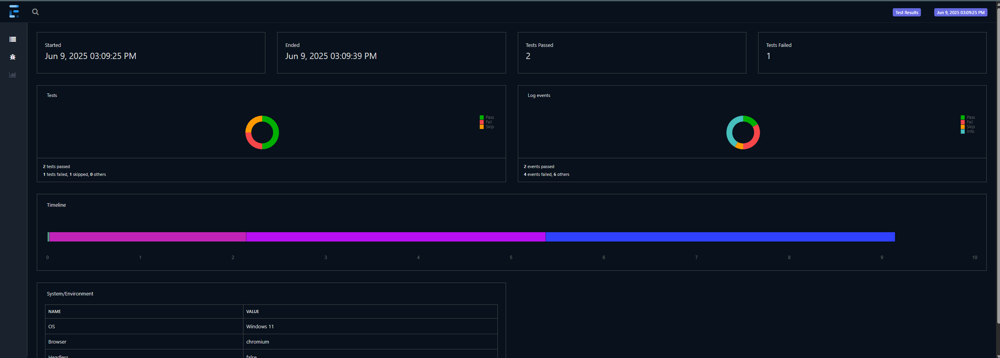
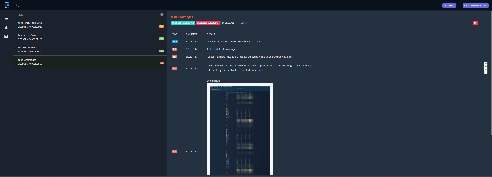
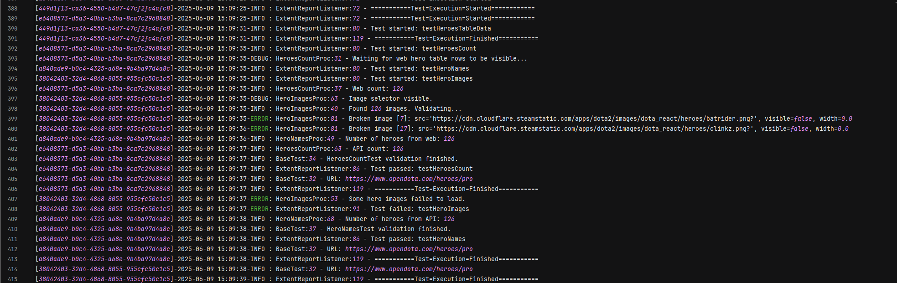

# Opendota Playwright Web Automation
This project provides an automated test suite for validating the OpenDota website. It uses the Playwright framework to interact with the web pages and compares the data displayed there against the data retrieved directly from the OpenDota API. It follows the Page Object Model design pattern, organizing web interactions by page.

## Technologies Used
|                   |                       |
| ----------------- | --------------------- |
| Language          | **Java**              |
| Build Tool        | **Maven**             |
| UI Framework      | **Playwright**        |
| Testing Framework | **TestNG**            |
| Reporting         | **ExtentReports**     |
| Logging           | **Log4j**             |
| Design Pattern    | **Page Object Model** |
| Remote Execution  | **Selenium Grid**     |

## Key Features

- **Page Object Model**: Organizes web interactions by page, making the code more maintainable and readable.
- **Report Generation**: Generates detailed HTML reports with ExtentReports, including screenshots of failed tests, test log IDs for tracking, and comprehensive insights into test execution.
- **Logging**: Uses Log4j for logging test execution details, which helps in debugging and understanding test flow.
- **Remote Execution**: Supports running tests on a Selenium Grid, allowing for parallel execution and cross-browser testing.

## Getting Started
### Prerequisites
- Java Development Kit (JDK) 21 or higher
- Maven 3.8.6 or higher for build and dependency management
- Playwright installed in your project (can be done via Maven dependencies)
- Selenium Grid setup (optional, for remote execution)
- Docker (optional, for running Selenium Grid in containers)

### Running Tests
#### Locally
- Open a terminal and navigate to the project directory and enter the command below:
   ```shell
   mvn clean test -DsuiteXmlFile="<selected testing xml file>"
   ```
#### Remotely (using Selenium Grid and Docker)
- Open docker desktop:
   ```shell
   docker desktop start
   ```
- Start the containers for Selenium Grid:
   ```shell
    docker compose up -d
    ```
- To connect Playwright to Selenium Grid, set the SELENIUM_REMOTE_URL environment variable. This variable should be set to the address of your Selenium Grid hub (for demo, this would typically be an address like http://localhost:4444 when running on a local machine). Note that this only works for Google Chrome and Microsoft Edge.
    - Windows (Command Prompt):
      ```shell
      set SELENIUM_REMOTE_URL=http://localhost:4444
      mvn clean test -DsuiteXmlFile="<selected testing xml file>"
    - Linux/Mac (Terminal):
      ```shell
      SELENIUM_REMOTE_URL=http://localhost:4444 mvn test -DsuiteXmlFile="<selected testing xml file>"
        ```
- When finished running remotely, you can stop the containers and close the Docker Desktop application:
   ```shell
   docker compose down
   ```
  ```shell
   docker desktop stop
   ```

## Extent Report
ExtentReports generates detailed HTML reports for test execution. The reports include:
- **Test Summary**: Overall test execution summary with pass/fail counts.
- **Test Details**: Detailed information for each test, including status, execution time, and any errors encountered.
- **Screenshots**: Screenshots of the web page when a test fails.
- **UUID**: Unique identifier for each test run, which can be used to track specific test executions.

Sample Screenshots of generated Extent Report:




## Logging
Log4j is used for logging throughout the test execution. It captures:
- Test execution details
- Errors and exceptions
- UUID for each test run for easier tracking.

